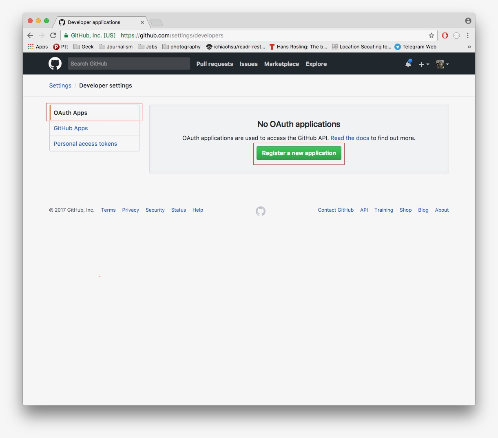
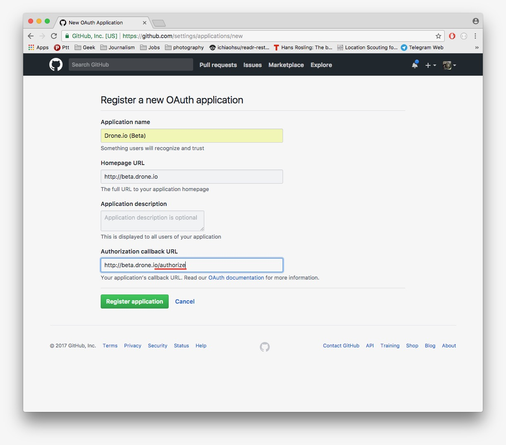
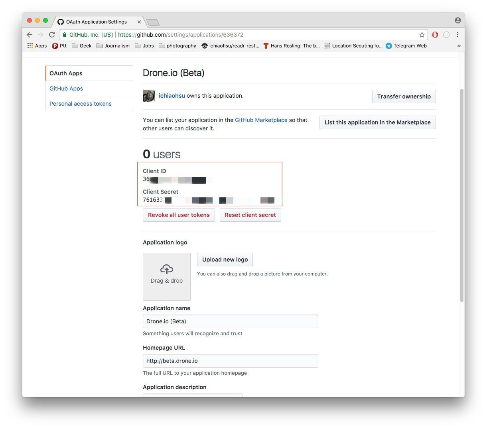

# 欲練神功，必先自......己搞定 Drone.io
[Drone.io](http://docs.drone.io/) 是一套可以自己 host 的連續導入伺服器，使用 yaml 格式的檔案描述發布時的 pipeline 行為。這與常見的 TravisCI，CircleCI 相近，差別在於 Drone.io 並非託管服務，而是要自己架設伺服器。目前 Drone 版本已經來到 0.8.x，有一些不小的更動。Drone server 與 drone agent 間的溝通在這版改成了 gRPC，造成了行為的改變，某些舊有的教學也就不再適用。像是目前 drone 就無法跑在 Kubernetes 中。第二個不同是 drone server 與 drone agent 已經分成兩個不同的檔案，所以在部署方式也有了改變。想要使用的朋友們，在搜尋資料時必須謹慎。

## Github, show me the token！
Drone 官方已經有提供 Gtihub 的整合，我們要做的事就是從 Github 產生一組 token 來做登入。先進入帳號的 `settings` 頁面，然後點選 `Developer settings`



在 `OAuth Apps` 頁面下，點下 `Register a new application`



在 `homepage URL` 必須填入你的 drone server 的位置，`Authorization callback URL` 一定要填入 `homepage URL` + `/authorize` 的位置，如圖中就是使用 https://beta.drone.io/authorize

按下 Register application，就會帶我們到達下面的頁面。紅框處的 `Client Token` 和 `Client Secret` 我們等下在 `docker-compose` 檔案裡面會用到。



## 芝麻開 Drone
[官方](http://docs.drone.io/installation/)提供的教學是使用 `docker-compose` 檔案來產生 drone server 和 drone agent。

```yaml
version: '2'

services:
  drone-server:
    image: drone/drone:0.8

    ports:
      - 80:8000
      - 9000
    volumes:
      - /var/lib/drone:/var/lib/drone/
    restart: always
    environment:
      - DRONE_OPEN=true
      - DRONE_ORGS=${ORGANIZATIONS WHERE REPOS IS}
      - DRONE_HOST=${DRONE_HOST}
      - DRONE_GITHUB=true
      - DRONE_GITHUB_CLIENT=${DRONE_GITHUB_CLIENT}
      - DRONE_GITHUB_SECRET=${DRONE_GITHUB_SECRET}
      - DRONE_SECRET=${DRONE_SECRET}

  drone-agent:
    image: drone/agent:0.8

    command: agent
    restart: always
    depends_on:
      - drone-server
    volumes:
      - /var/run/docker.sock:/var/run/docker.sock
    environment:
      - DRONE_SERVER=drone-server:9000
      - DRONE_SECRET=${DRONE_SECRET}
```

`DRONE_HOST` 就是 drone server 的位置，和在 Github 上填的位置一樣。由於我們使用 Github，`DRONE_GITHUB` 就設為 `true`。沒有設定 `DRONE_ORGS` 的話， drone 就只能拿到你自己帳號下面的 repo。在這項設定裡設好你的組織帳號，drone 就可以拿到組織帳號下的 repo。`DRONE_GITHUB_CLIENT` 和 `DRONE_GITHUB_SECRET` 兩項分別填入在 Github OAuth App 裡拿到的 `Client Token` 和 `Client Secret`。最後，drone server 和 drone agent 透過一組金鑰溝通，產生一組金鑰後分別在drone server 及 drone agent 的 `DRONE_SECRET` 裡設定好。Mac 的使用者可以用以下方式產生：
```bash
echo -n "STRING" | base64
```

接下來，見證奇蹟的時刻
```bash
docker-compose up -d
```

在瀏覽器裡拜訪 `DRONE_HOST`，就可以對 drone 做各種設定了。